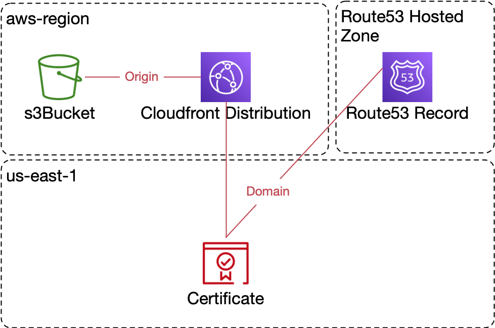

# HAWS

HAWS is an achronym from Hugo on AWS

HAWS is a simple CLI application that creates an S3 bucket and a CloudFront distribution for serving a static HUGO website.

Its current form can be used for any static site generator but only includes a configuration generator for HUGO config.

## Usage

```txt
  haws [command]

Available Commands:
  deploy      Deploy the cloudformation stacks
  generate    Generate configs
  help        Help about any command

Flags:
      --bucket-path string   Path prefix that will be appended by cloudfront to all requests (it should correspond to a sub-folder in the bucket)
      --config string        config file (default is .haws.toml in current directory)
  -h, --help                 help for haws
      --log-level string     Log level (debug, info, warn, error) (default "info")
      --prefix string        Prefix for resources created. Can not be empty
      --record string        Record name to be added to R53 zone
      --region string        AWS region for the bucket and cloudfront distribution
      --zone-id string       AWS Id of the zone used for SSL certificate validation and where the record should be added

Use "haws [command] --help" for more information about a command.
```

### Config file structure (.haws.toml)

```toml
region = "eu-central-1"
prefix = "site"
record = "my-site"
zone-id = "AWS_ZONE_ID"
bucket-path = "/my-site"
log-level = "info"  # Optional: debug, info, warn, or error
```

### HAWS deploy

Use `haws deploy` to crate and deploy the CloudFormation templates for a new static website.

### HAWS generate

Use `haws generate` to print at the terminal the minimal config required for HUGO to use the configuration deployed earlier.

## Infrastructure

Haws will create several CloudFormation Stacks in your AWS account that will, in turn, create the folowing resources:



## Use Cases

### Hosting one single site in it's own bucket with it's own domain

#### Prerequisires

- we have a delegated domain (let-s say `example.com`) to a R53 zone (`AWS_ZONE_ID_MY_DOMAIN`)
- the name of the site will be `www`

#### Example configuration

- create a `.haws.toml` for the new site:
  
```toml
region = "eu-centeral-1"
prefix = "www"
record = "www"
zone-id = "AWS_ZONE_ID_MY_DOMAIN"
bucket-path = "/"
```

Except for the zone-id and region the parameters are not critical.

### Hosting multiple sites under the same doamin

For this use case we can use one bucket or multiple buckets but in this example we can go with only one bucket.

The name of the bucket is determined by the prefix and domain name (that we get from the AWS Route53 zone)

#### Prerequisires

- one delegated domain (let-s say `example.com`) to a R53 zone (`AWS_ZONE_ID_MY_DOMAIN`)
- the name of the first site will be `www`
- the name of the other site will be `blog`

So `https://www.example.com` and `https://blog.example.com` will be stored in the same bucket and served with the same TLS certificate

#### Example configuration

For `www.example.com`:

```toml
region = "eu-centeral-1"
prefix = "unified"
record = "www"
zone-id = "AWS_ZONE_ID_MY_DOMAIN"
bucket-path = "/www"
```

For `blog.example.com`:

```toml
region = "eu-centeral-1"
prefix = "unified"
record = "blog"
zone-id = "AWS_ZONE_ID_MY_DOMAIN"
bucket-path = "/blog"
```

Note that prefix is the same for both config files. That way haws will create only one bucket and only one certificate but it will creaqte two CloudFront distributions with two origins for the two sites.

## Logging

HAWS provides configurable logging with different verbosity levels to help with debugging and monitoring the application's operation. The log levels can be set via the `--log-level` flag or in the config file.

### Available Log Levels:

1. **debug** - Most verbose, includes detailed information for debugging
2. **info** - (Default) General operational information 
3. **warn** - Warning events that might require attention
4. **error** - Error events that might still allow the application to continue running

### Examples:

To run with debug logs:

```bash
haws deploy --log-level debug
```

To set the log level in the config file:

```toml
log-level = "debug"
```

### Log Output Format:

Each log entry includes:
- Timestamp
- Log level (color-coded for better readability)
- Message

For example:
```
[2025-05-30 14:32:45] INFO: Creating stack: my-prefix-certificate
```

## Development

### Requirements

- Go 1.22 or later
- AWS credentials configured for your environment

### Testing

HAWS includes unit tests for several packages. To run all tests:

```bash
./run_tests.sh
```

The test script has several options:

```bash
# Run tests with minimal output
./run_tests.sh

# Run tests with verbose output
./run_tests.sh verbose

# Run tests with code coverage report
./run_tests.sh coverage

# Run tests with verbose output and code coverage
./run_tests.sh v-cov
```

This script will run all tests and provide a summary of passed, failed, and skipped tests. When run with the `coverage` option, it will generate a code coverage report. The `v-cov` option will also generate an HTML coverage report that you can view in your browser.

To run tests for specific packages:

```bash
go test -v ./pkg/logger
```

### Contributing

Please see the [CONTRIBUTING.md](CONTRIBUTING.md) file for details on how to contribute to this project.
